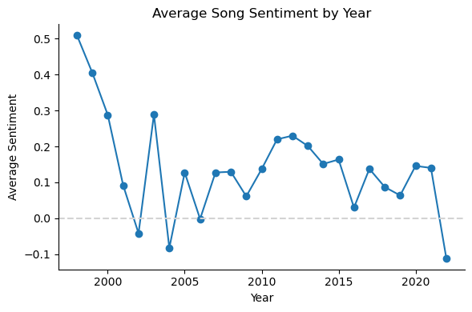
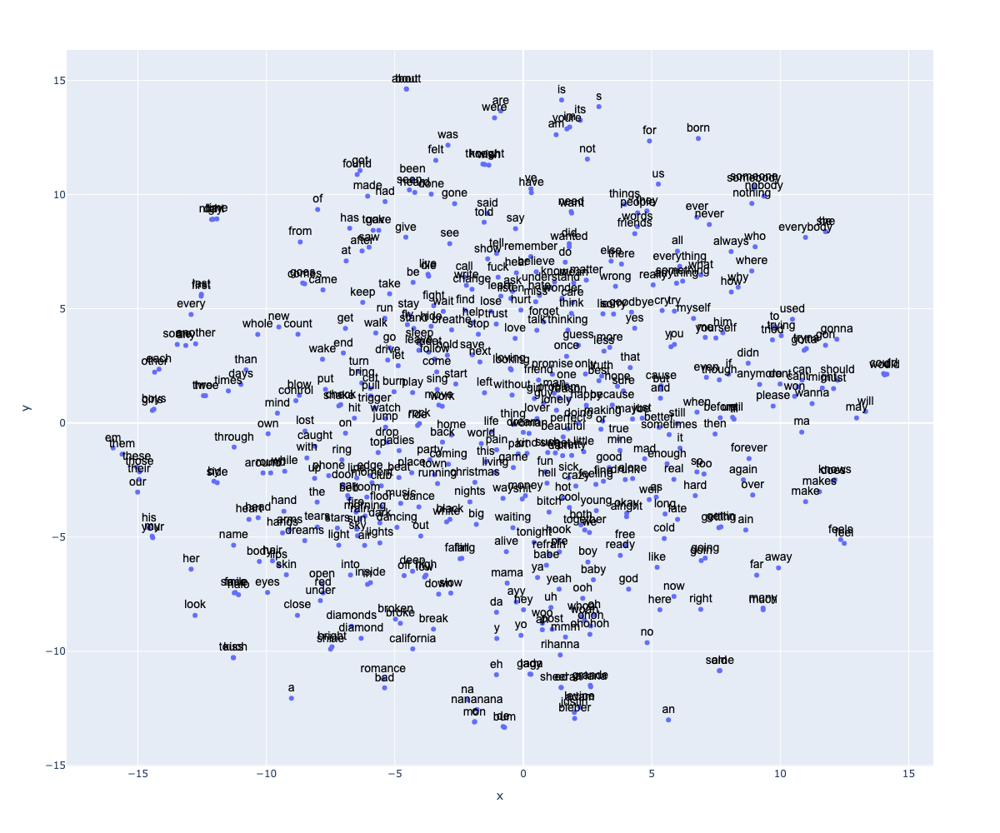
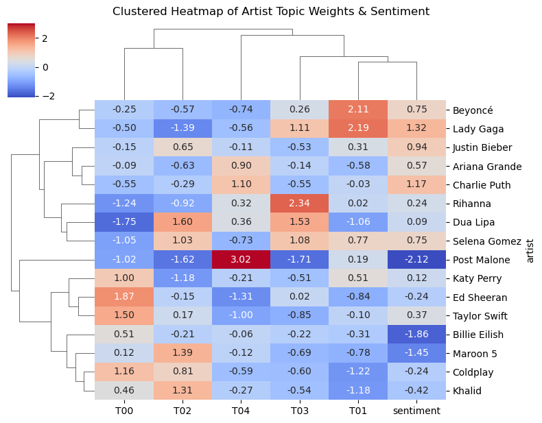

# Music Lyrics Text Analytics

Natural language processing and text analytics project analyzing song lyrics using tokenization, TF-IDF, Word2Vec embeddings, sentiment analysis, dimensionality reduction, and visualization techniques.

---

## Overview

This project explores large-scale text analytics and natural language processing techniques using a corpus of song lyrics from multiple musical artists. The analysis focuses on text preprocessing, corpus construction, feature engineering, sentiment analysis, topic exploration, and embedding-based visualization.

---

## Project Goals

The project aimed to:
- build a structured NLP pipeline for song lyric analysis
- explore lyrical themes and sentiment patterns
- generate vector representations of text using Word2Vec
- visualize relationships between songs, words, and artists
- apply dimensionality reduction and clustering techniques to high-dimensional text data

---

## Methods

Techniques used throughout the project included:

- Tokenization and text preprocessing
- Corpus and vocabulary construction
- TF-IDF feature engineering
- Word2Vec embeddings
- Sentiment analysis
- PCA and t-SNE visualization
- Topic and clustering analysis

---

## Project Workflow

The notebooks are organized as a step-by-step NLP pipeline:

| Notebook | Purpose |
|---|---|
| `01_corpus_and_annotation.ipynb` | Text parsing, annotation, and corpus construction |
| `02_feature_engineering.ipynb` | Derived tables and feature engineering |
| `03_nlp_models.ipynb` | NLP modeling and embeddings |
| `04_exploratory_analysis.ipynb` | Exploratory analysis and additional visualizations |
| `05_final_project_analysis.ipynb` | Final integrated project notebook |

---

## Visualizations

### Sentiment Analysis

### Word2Vec t-SNE Visualization

### Topic and Sentiment Clustering

---

## Technologies

- Python
- pandas
- NumPy
- nltk
- gensim
- scikit-learn
- matplotlib
- seaborn

---

## Notes

Intermediate datasets and derived tables were omitted from this repository to keep the project lightweight and focused on methodology, modeling, and visualization.
